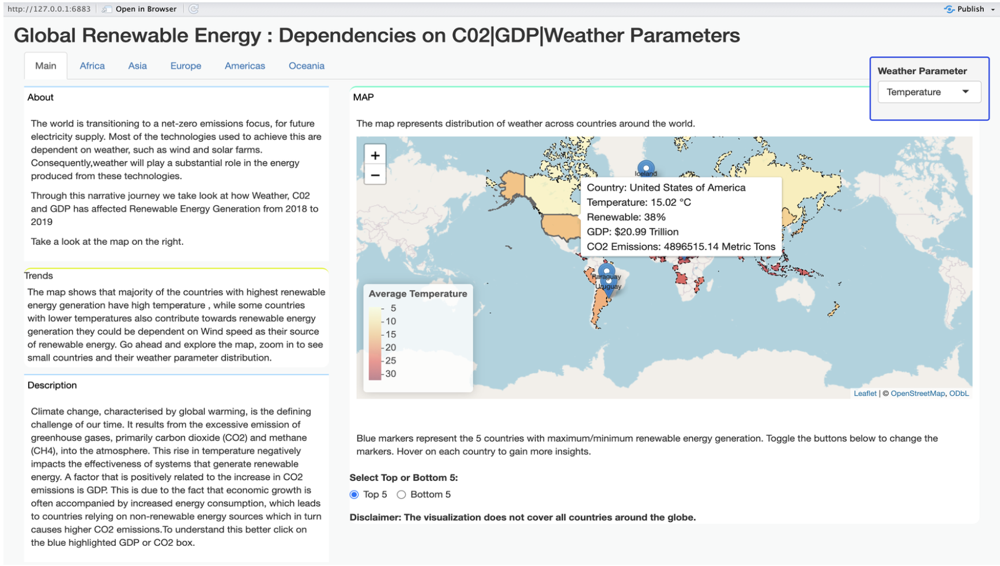

# Renewable Energy Visualization Project

## Overview

This project presents a set of interactive and dynamic visualizations in R to analyze global renewable energy trends, their relationship with GDP, CO2 emissions, and various weather parameters. It aims to provide insights into the role of renewable energy in mitigating climate change and support advocacy efforts for sustainable energy solutions.

## Features

### Choropleth Map
- Displays average temperature or wind speed for different countries.
- Allows users to toggle between temperature and wind data.
- Interactive map created using Leaflet with shapefiles merged with CSV data.

### Animated Bar Graph
- Highlights average CO2 emissions and GDP for the top 10 and bottom 10 countries based on renewable energy usage.
- Features smooth transitions using gganimate and gifski for user engagement.

### Regional Tabs
- Interactive tabs for each region to analyze specific countries.
- Individual maps rendered for selected regions using Leaflet.

### Proportional Symbol Chart
- Visualizes renewable energy, GDP, and CO2 emissions as nested squares.
- Scaled to depict relative values as percentages.
- Dynamically updates based on the selected country.

### Stacked Area Chart
- Shows renewable energy trends overlaid with temperature or wind data.
- Interactive selection for weather parameters using ggplot.

## Getting Started

### Prerequisites
- R and RStudio installed on your machine.
- Required R packages: `sf`, `ggplot2`, `gganimate`, `gifski`, `Leaflet`.

### Setup
1. Downloads all the provided files store in a single folder.
1. Open `ui.R` and `server.R` files in RStudio.
2. Click on **Run App** to launch the application.

## Usage
1. Start with the **About** section to understand the purpose and navigation.
2. Explore the **Main Page** for an overview and animated bar charts.
3. Navigate through **regional tabs** for detailed analyses.
4. Use dropdowns and buttons for interactive exploration of maps, charts, and trends.
